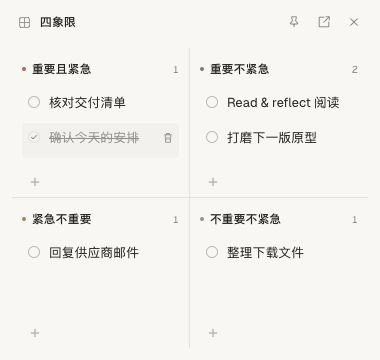
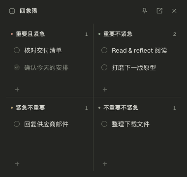
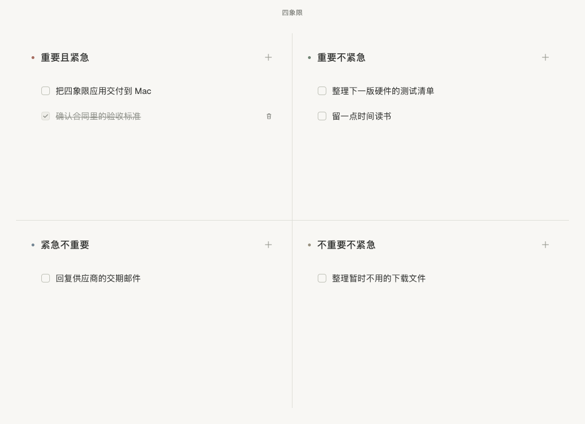
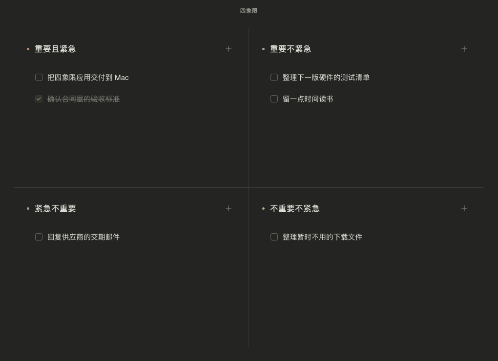

# 四象限

极简、本地、只做四象限任务管理的 macOS 桌面应用。

使用 Tauri 2 + React + TypeScript 开发。无需服务器、账号、网络或订阅，任务自动保存在本机。主窗口与桌面悬浮小组件均采用 2×2 任务矩阵，共用同一份本地数据。

## 下载与安装

| 安装包 | 下载 | 适用平台 |
| --- | --- | --- |
| DMG 安装镜像，约 2.9 MB | [下载 DMG](https://github.com/MY-123-hub/four-quadrants/raw/refs/heads/main/release/%E5%9B%9B%E8%B1%A1%E9%99%90_1.1.0_aarch64.dmg) | Apple Silicon Mac，macOS 11+ |
| `.app` 压缩包，约 2.3 MB | [下载 ZIP](https://github.com/MY-123-hub/four-quadrants/raw/refs/heads/main/release/%E5%9B%9B%E8%B1%A1%E9%99%90_1.1.0_aarch64.app.zip) | Apple Silicon Mac，macOS 11+ |

打开 DMG，把“四象限”拖入 Applications 后启动。也可解压 ZIP，直接打开 `四象限.app`。安装包直接存放在本仓库的 [release](release) 目录，无需安装 Node.js 或 Rust。

**当前提供 arm64 版本（M 系列 Mac），尚未提供 Intel / Universal 安装包。未使用 Apple Developer 身份签名或公证。**

校验下载文件：

```sh
shasum -a 256 四象限_1.1.0_aarch64.dmg
```

预期校验值见 [SHA256SUMS.txt](release/SHA256SUMS.txt)。

## 1.1.0 桌面悬浮小组件

在主窗口右上角点击四格图标，或使用“窗口 → 显示悬浮小组件”（Cmd+Shift+W）。默认约 380×360，可拖动、缩放，记忆位置和尺寸。

- 图钉切换始终置顶，默认允许其他应用覆盖；置顶选择会保留。
- 右上角打开图标唤起主窗口，关闭图标隐藏小组件。
- 每格底部的 `+` 原位新增任务；点击圆圈完成，再次点击取消完成。
- 任务文字可原位编辑，删除按钮仅在悬停或键盘聚焦时出现。
- 未完成项优先显示，长标题最多两行，四格分别滚动。
- 两个窗口即时同步，原生事务合并字段变更，避免旧文档覆盖其他窗口的修改。
- 关闭主窗口也只隐藏窗口，小组件继续运行；Cmd+Q 才退出整个应用。点击 Dock 图标或使用 Cmd+Shift+M 可重新打开主窗口。

小组件会在下次启动时恢复上次的显示状态。深浅主题跟随系统，并遵守减少动态效果设置。移除外接显示器后，再显示小组件时会把窗口收回到当前屏幕可见区域。





1.0.1 的顶部拖动权限修复仍然保留。

## 界面

浅色模式：



深色模式：



截图中的任务仅为演示，首次启动没有预置任务。主题自动跟随 macOS 系统。

## 使用

- 点击象限右上角的 `+`，输入任务名称，按 Enter 或点击别处保存。
- 点击任务文字原位编辑，Enter 保存，Escape 取消。中文输入法选字不会提前提交。
- 勾选完成，任务淡化并加删除线；再次勾选可取消完成。
- 悬停任务时，左侧出现拖动手柄，右侧出现删除按钮。
- 拖动手柄可在四个象限之间移动任务，也可调整同一象限内的顺序。
- 支持键盘拖放：聚焦手柄，按空格开始、方向键移动、空格放下，Escape 取消。
- 所有操作自动保存。关闭窗口会先提交当前编辑并等待保存完成，然后隐藏；Cmd+Q 和菜单退出会等待两个窗口共同确认后退出。

四个象限各自滚动，窗口缩放时保持 2×2。没有登录、云同步、日历、统计、标签或 AI 功能。

## 本地数据

正式任务保存在 SQLite：

```text
~/Library/Application Support/com.local.fourquadrants/tasks.sqlite3
```

数据不放在应用包或代码仓库中。退出、重新打开或替换应用包，已有任务仍保留。

SQLite 使用 WAL 和 `synchronous=FULL`，每次任务变更在事务中合并到最新文档，递增 revision 后广播给两个窗口。读盘失败不会把旧数据重置为空；写盘失败会保留窗口中的修改，显示重试入口，并阻止未保存的退出。

备份时先退出应用，再复制整个 `com.local.fourquadrants` 目录。

浏览器预览使用独立的 localStorage，仅供开发，与正式应用数据隔离。

## 开发

需要 Node.js 22+、Rust stable 和 macOS Xcode Command Line Tools。

```sh
git clone https://github.com/MY-123-hub/four-quadrants.git
cd four-quadrants
npm ci
npm run tauri -- dev
```

只查看浏览器预览：

```sh
npm run dev
```

## 测试与构建

```sh
npm run build
npm run test
npx playwright install chromium webkit
npm run test:e2e
cargo test --manifest-path src-tauri/Cargo.toml --release
npm run tauri -- build --bundles app
npm run package:macos
```

macOS 构建需要在 Mac 上进行。原始产物分别位于：

```text
src-tauri/target/release/bundle/macos/四象限.app
release/四象限_1.1.0_aarch64.dmg
release/四象限_1.1.0_aarch64.app.zip
```

`npm run package:macos` 构建应用、进行本机 ad-hoc 签名，并生成 DMG / ZIP 与 SHA256SUMS，避免依赖 Finder 自动排版。ad-hoc 签名不等同于 Apple Developer 签名或公证。

目前通过 10 项前端规则与同步队列测试、20 项 Chromium / WebKit 交互检查、8 项 Rust 持久化与并发测试。已在真实 `.app` 中验证双窗口同步、窗口拖动与缩放、置顶层级、隐藏、退出前提交编辑和重启恢复。整机重启、多个实体显示器及其他 Mac 硬件尚未现场验证。

## 项目结构

```text
src/domain/       任务结构、校验与移动排序规则
src/storage/      存储适配、变更队列与跨窗口同步
src/components/   任务行、原位编辑与四象限布局
src/windows/      前端窗口动作与生命周期
src-tauri/src/    原生 SQLite、窗口状态和退出协调
docs/             设计取舍、截图和验证记录
release/          可直接下载的安装包
```

[设计说明](docs/DESIGN.md) · [验证记录](docs/VERIFICATION.md)

## 许可证

项目代码以 [MIT License](LICENSE) 开源。

Geist 字体本地打包，遵循 [SIL Open Font License 1.1](docs/Geist-OFL.txt)。中文使用 macOS 系统苹方。依赖许可文本见 [第三方声明](docs/THIRD-PARTY-NOTICES.txt)，并包含在应用包内。
